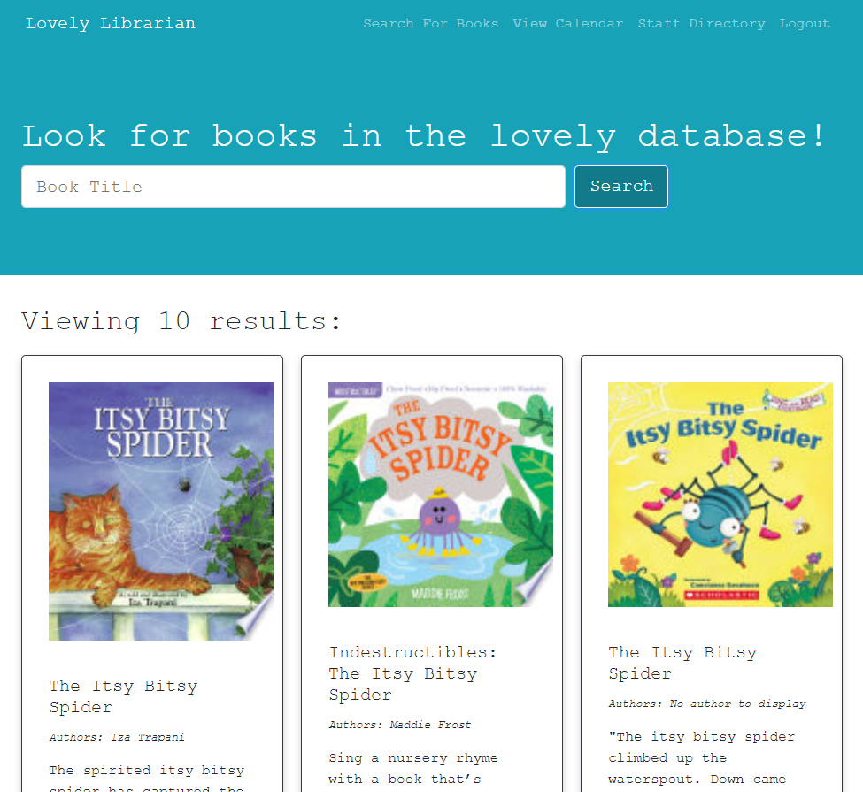

# The greatest Librarian's app the internet has ever seen!

### [Lovely Librarian Live App (Click Me!)](https://lovely-librarian.herokuapp.com/)

## Table of Contents
- [Screenshot](#screenshot)
- [Description](#description)
- [Technologies](#technologies)
     - [Packages Used](#npm-packages)
     - [API's](#api-used)
- [Created By](#created-by)
     - [Credits](#credits)
- [License](#license) 
- [Questions, Comments, Suggestions](#questions-comments-suggestions)

## Screenshot

### Description
Lovely Librarian is a responsive PWA that is used by librarians for internal library tasks. It is a MERN SPA that follows mobile-first practices.

### Technologies:
- React
- JavaScript
- JSX
- CSS
- MongoDB
- Node.JS
- GraphQL

##### npm Packages:
- [Create React App](https://github.com/facebook/create-react-app)
- [Nodemon](https://www.npmjs.com/package/nodemon)
- [bcrypt](https://www.npmjs.com/package/bcrypt)
- [concurrently](https://www.npmjs.com/package/concurrently)
- [apollo-server-express](https://www.npmjs.com/package/apollo-server-express)
- [express](https://www.npmjs.com/package/express)
- [graphql](https://www.npmjs.com/package/graphql)
- [jsonwebtoken](https://www.npmjs.com/package/jsonwebtoken)
- [mongoose](https://www.npmjs.com/package/mongoose)
- [@apollo/client](https://www.npmjs.com/package/@apollo/client)
- [dotenv](https://www.npmjs.com/package/dotenv)
- [jwt-decode](https://www.npmjs.com/package/jwt-decode)
- [@fullcalendar/react](https://www.npmjs.com/package/@fullcalendar/react):
     - [@fullcalendar/timeGrid](https://www.npmjs.com/package/@fullcalendar/timegrid)
     - [@fullcalendar/dayGrid](https://www.npmjs.com/package/@fullcalendar/daygrid)
     - [@fullcalendar/interaction](https://www.npmjs.com/package/@fullcalendar/interaction)

##### API Used
- [Google Books API](https://developers.google.com/books/docs/overview)

### Created By:

- [Bri Cassellius](https://github.com/bcassellius)
- [Z Kaoher](https://github.com/kaohzina)
- [Kyle Sorensen](https://github.com/ksore85)
- [Colton Watkins](https://github.com/watkincw)

#### Credits
- [React Full Calendar](https://www.youtube.com/watch?v=oY1Xfgc22FI&list=PLcid17FgwwjbMal34PfuiCa1Al_8WU_-I)
- [Staff Directory Seach Form](https://www.youtube.com/watch?v=mZvKPtH9Fzo)

## License

### [Github Repository Link](https://github.com/bcassellius/lovely-librarian.git)

#### Questions, Comments, Suggestions
Please email [Kyle Sorensen](mailto:ksore85@gmail.com), [Bri Cassellius](mailto:bhilliker@gmail.com), [Z Kaoher](mailto:kaohzina@gmail.com) or [Colton Watkins](mailto:watkincw@gmail.com) with any questions, to comment on any bugs, or to make any suggestions.
